<h1 align="center">ChurnSense</h1>
<p align="center">
  <strong>Multi-Class Temporal Churn Prediction · Risk Trajectories · ROI Optimizer · Live Dashboard</strong>
</p>

<p align="center">
  <a href="YOUR_STREAMLIT_URL"></a>
  &nbsp;
  
  &nbsp;
  
  &nbsp;
  
  &nbsp;
  
</p>

<p align="center">
  Built during <strong>Coding Blocks School of Technology SIP 2026</strong>
</p>

---

## What this project does

Most churn projects answer a binary question: **will this customer leave?**

ChurnSense answers the four questions that actually matter to a business:

| Question | Answer |
|---|---|
| **Who** is at risk? | 4-class risk tier — Loyal / At-Risk / Critical / Will-Churn |
| **When** will they churn? | 30 / 60 / 90-day temporal predictions |
| **How fast** is their risk escalating? | Stable / Improving / Escalating / Rapid Escalation trajectory |
| **Who do we call first** given a fixed budget? | ROI-ranked intervention list, budget-constrained |

---

## Why this is different from every other churn project

| Capability | Standard approach | ChurnSense |
|---|---|---|
| Prediction | Binary Yes / No | 4 risk tiers |
| Time horizon | Single snapshot | 30 / 60 / 90-day projections |
| Model objective | Minimise error rate | **Minimise business cost** (cost matrix) |
| Explainability | None | SHAP per customer |
| Risk trend | Not tracked | Escalation trajectory per customer |
| Business output | Churn probability | ROI-ranked contact list |
| Deployed | Jupyter notebook | **Live Streamlit dashboard** |

---

## Live results — real numbers from 7,043 customers

### Phase 1 · Multi-class prediction

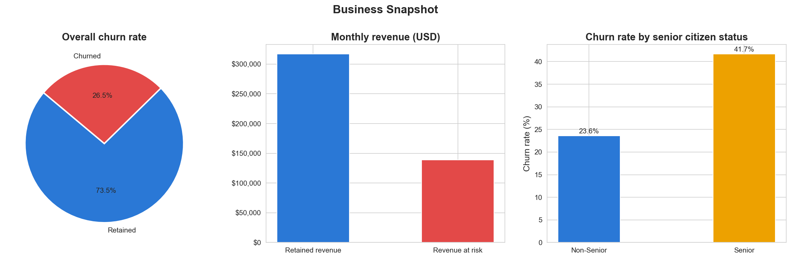

**26.5% overall churn rate — $139k/month in lost revenue.**  
Senior citizens churn at 41.7% vs 23.6% for non-seniors.

---

### The 4-class innovation

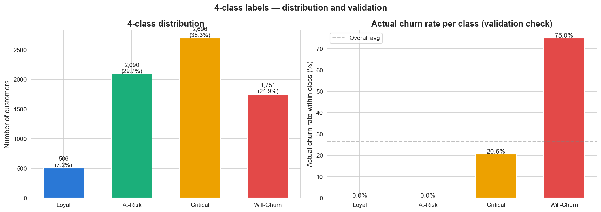

The IBM Telco dataset includes a `Churn Score` column (0–100) that most implementations ignore.  
ChurnSense uses it to define four urgency tiers:

| Class | Score | Customers | Action |
|---|---|---|---|
| **Loyal** | 0–25 | 506 (7.2%) | Loyalty rewards |
| **At-Risk** | 26–50 | 2,090 (29.7%) | Re-engagement email |
| **Critical** | 51–75 | 2,696 (38.3%) | Personal call + offer |
| **Will-Churn** | 76–100 | 1,751 (24.9%) | Urgent: immediate high-value intervention |

**Validation:** actual churn rate increases monotonically across classes — 0% (Loyal) → 20.6% (Critical) → 75% (Will-Churn). The labels are grounded, not arbitrary.

---

### Business cost matrix

<p align="center">
  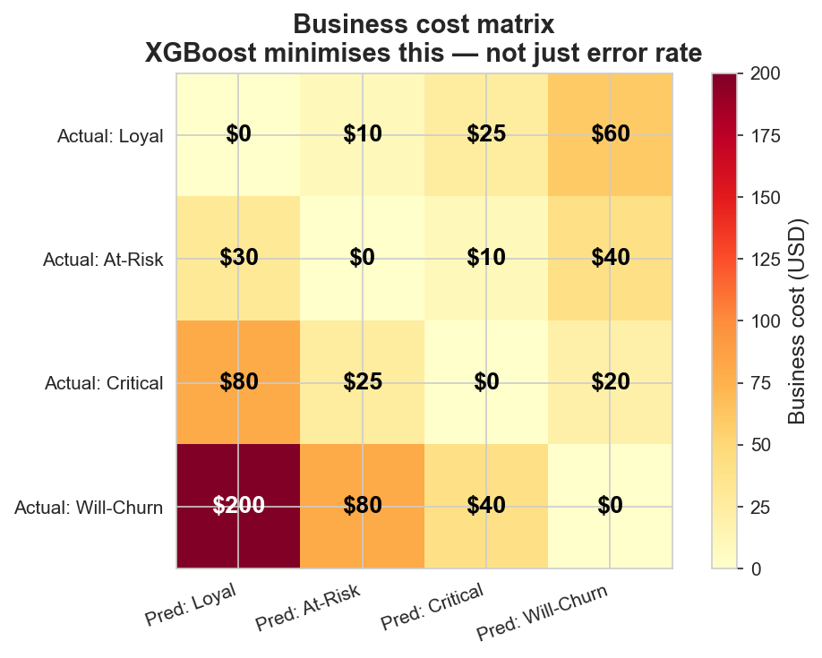
</p>

Missing a Will-Churn customer costs $200 in lost revenue. A false alarm on a Loyal customer wastes $60 in outreach budget. These costs become `sample_weight` passed to XGBoost — the model learns to **minimise revenue loss, not prediction error**. No standard implementation does this.

---

### Model performance

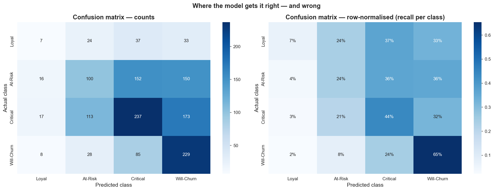

| Class | Precision | Recall | F1 | Notes |
|---|---|---|---|---|
| Loyal | 14.6% | 6.9% | 9.4% | Cost matrix intentionally de-prioritises — false Loyal predictions cost $60 |
| At-Risk | 37.7% | 23.9% | 29.3% | Hardest class — sits between two adjacent classes |
| Critical | 46.4% | 43.9% | 45.1% | Largest class, strong performance |
| **Will-Churn** | **39.1%** | **65.4%** | **48.9%** | **Highest recall — cost matrix working as intended** |

**Overall accuracy: 40.7%** (4-class random baseline = 25%).  
**Only 2.3% of Will-Churn customers are completely missed** — the $200 mistake is rare.  
**Weighted F1: 0.39 · Macro F1: 0.33**

The accuracy number looks low without context. The cost matrix deliberately sacrifices Loyal/At-Risk accuracy to maximise Will-Churn recall — which is the financially correct tradeoff.

---

### What drives predictions

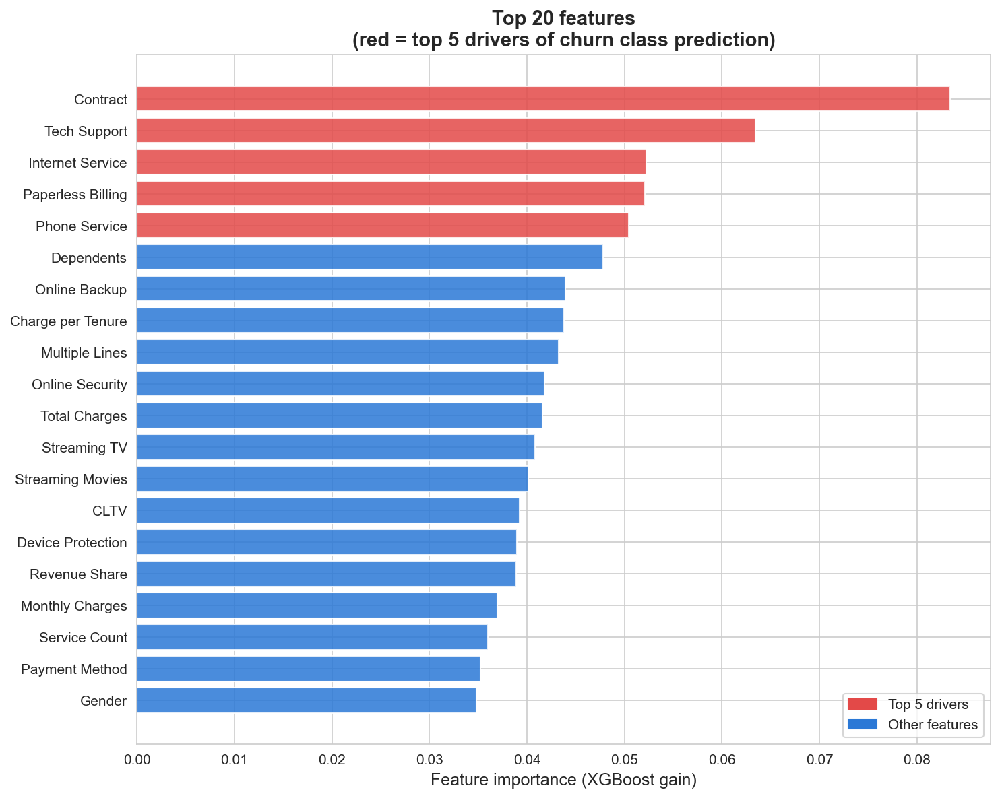

**Contract type is the single strongest predictor** (importance = 0.083) — month-to-month customers carry 3–4× the churn risk of two-year holders. Tech Support and Internet Service follow. The engineered feature `Charge per Tenure` ranks 8th — capturing price sensitivity that raw charge columns miss.

---

### EDA highlights

<table>
  <tr>
    <td>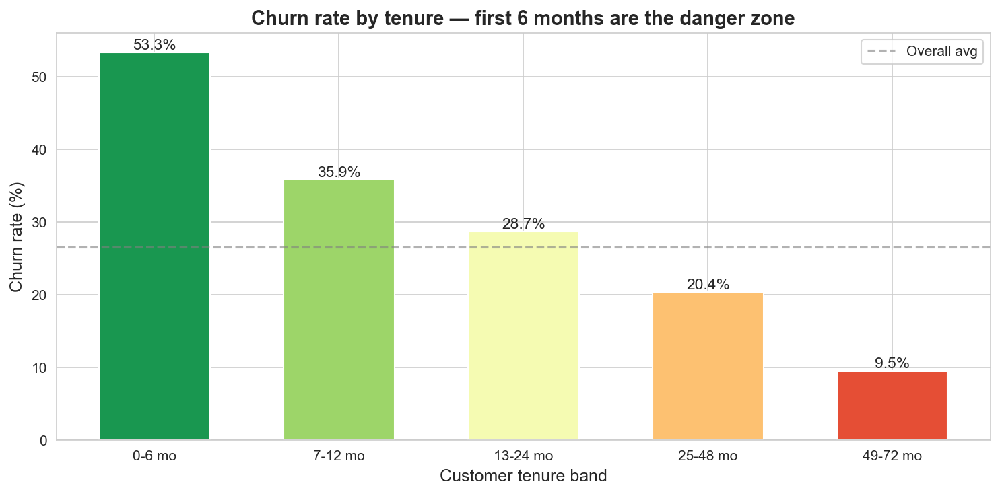</td>
    <td>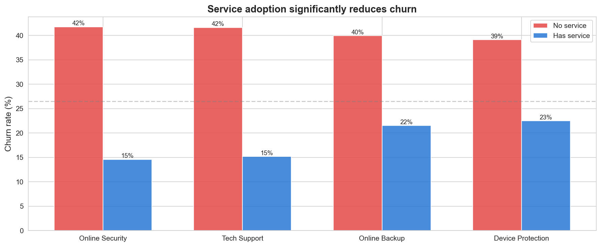</td>
  </tr>
  <tr>
    <td align="center"><em>Customers in months 0–6 churn at 53% — highest risk window in the lifecycle</em></td>
    <td align="center"><em>No Online Security = 42% churn. Has Online Security = 15% churn. 2.8× gap.</em></td>
  </tr>
  <tr>
    <td>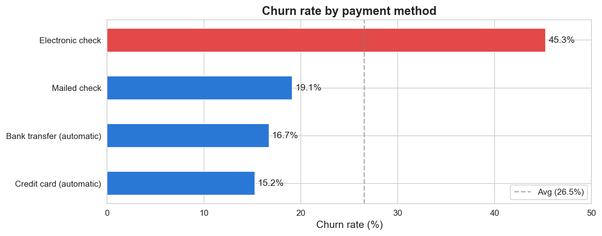</td>
    <td>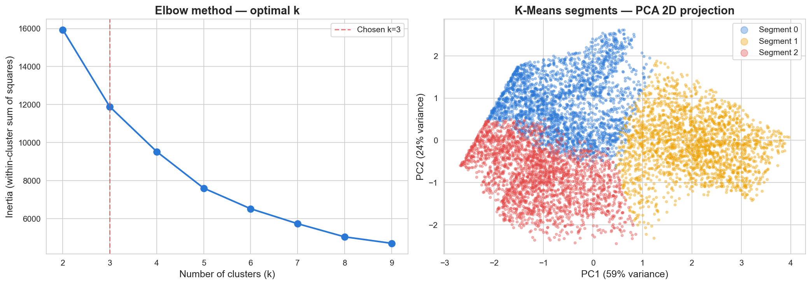</td>
  </tr>
  <tr>
    <td align="center"><em>Electronic check users churn at 45.3%. Auto-pay customers: 15–17%. Passive retention lever.</em></td>
    <td align="center"><em>K-Means (k=3) identifies three behavioural segments — profiled by spend and churn rate</em></td>
  </tr>
</table>

---

### Phase 1 business impact

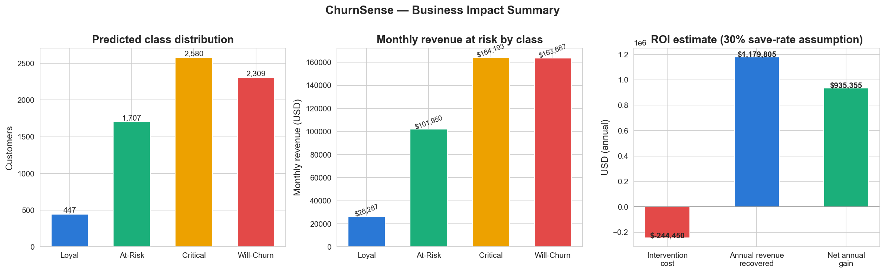

---

## Phase 2 · Temporal predictions · Trajectories · ROI Optimizer

### Multi-horizon risk predictions

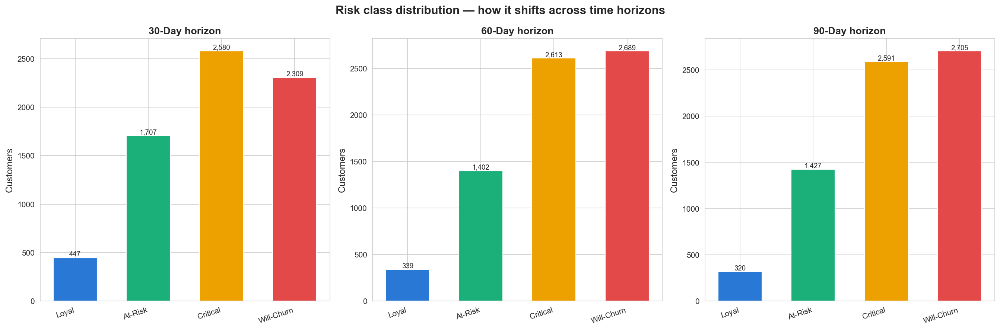

Customer features are projected forward in time — tenure accumulates, charges grow — and the model re-predicts at each horizon:

| | 30 Days | 60 Days | 90 Days |
|---|---|---|---|
| **Loyal** | 447 | 339 | 320 |
| **At-Risk** | 1,707 | 1,402 | 1,427 |
| **Critical** | 2,580 | 2,613 | 2,591 |
| **Will-Churn** | 2,309 | 2,689 | **2,705** |

**396 additional customers cross the Will-Churn threshold between 30 and 90 days** if no intervention happens.

---

### Risk escalation trajectories

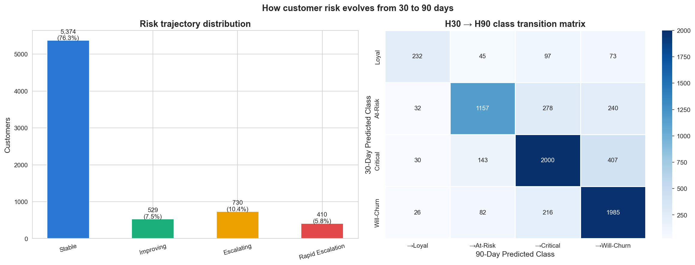

| Trajectory | Count | % | Priority |
|---|---|---|---|
| Stable | 5,374 | 76.3% | Normal monitoring |
| Improving | 529 | 7.5% | Continue engagement |
| **Escalating** | **730** | **10.4%** | **Intervene this week** |
| **Rapid Escalation** | **410** | **5.8%** | **Contact within 48 hours** |

**1,140 customers (16.2%) have rising risk** over the 90-day window.

---

### Sankey: risk flow 30-day → 90-day

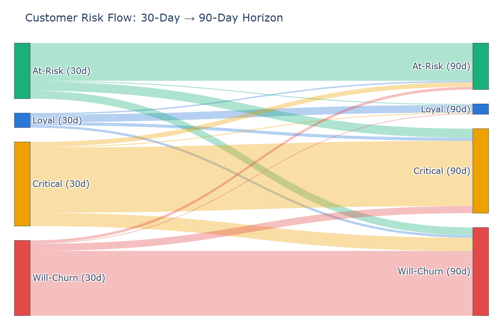

The Sankey shows exactly which customers stay in their class and which migrate upward. Most Will-Churn customers at 30 days remain Will-Churn at 90 days — the window to act is narrow.

---

### ROI-optimised intervention

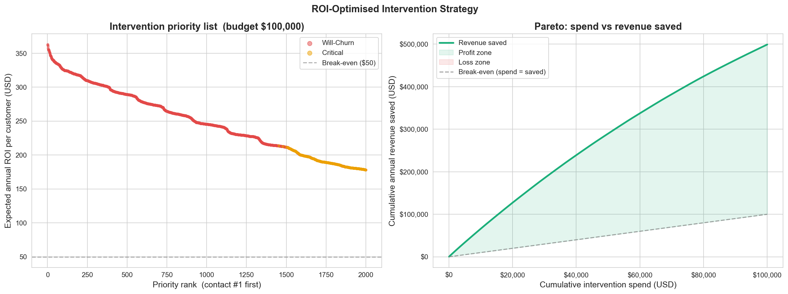

Every at-risk customer is scored by expected annual revenue ROI:
```
Expected ROI = Monthly Charges × 12 × churn_probability × save_rate
```

Sorted descending → top 2,000 contacts fit within a $100k budget at $50/contact.

| Metric | Value |
|---|---|
| Budget | $100,000 |
| Customers contacted | 2,000 |
| Expected customers saved | 600 |
| Annual revenue recovered | **$499,163** |
| Total intervention spend | $100,000 |
| **Net annual gain** | **$399,163** |
| **ROI multiple** | **4.99×** |

The Pareto chart (right) shows the profit zone — revenue saved grows faster than spend throughout the budget range.

---

### Budget sensitivity

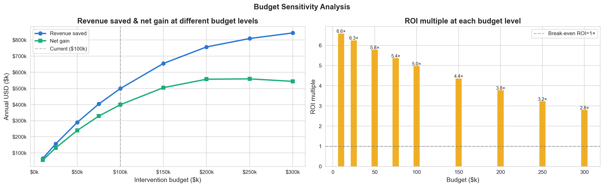

ROI is positive and above 2.8× across all tested budget levels ($10k–$300k). The optimal budget is around $150k where the net gain curve begins to flatten.

---

### Phase 2 business impact summary

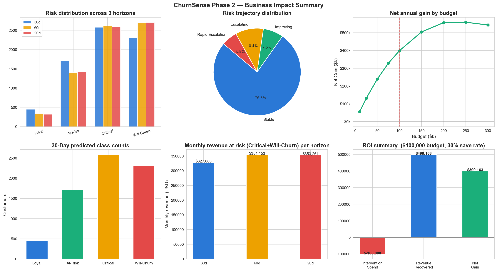

**$327,880/month in revenue sits in the Critical and Will-Churn tiers right now.**  
With a $100k intervention budget: **4.99× ROI, $399k net annual gain.**

---

## Live dashboard

> **[Open ChurnSense on Streamlit Cloud →](YOUR_STREAMLIT_URL)**

The dashboard has 5 tabs:

| Tab | What it shows |
|---|---|
| 📊 Overview | 30-day risk distribution, revenue at risk |
| ⏱️ Temporal Predictions | 30/60/90-day grouped comparison + delta table |
| 📈 Risk Trajectories | Trajectory pie, Sankey flow, top escalating customers |
| 💰 ROI Optimizer | Budget slider → live contact list + downloadable CSV |
| 🔍 SHAP Analysis | Per-customer SHAP bar chart explaining individual predictions |

Upload any Telco-format CSV → get instant multi-horizon predictions, risk trajectories, and a priority contact list.

---

## Project structure

```
ChurnSense/
├── app.py                          ← Streamlit dashboard entry point
├── src/
│   ├── __init__.py
│   ├── temporal_features.py        ← feature projection + trajectory classification
│   ├── roi_optimizer.py            ← budget-constrained intervention optimizer
│   └── predictor.py                ← shared preprocessing + inference pipeline
├── ChurnSense_Phase1.ipynb         ← EDA, segmentation, 4-class model, SHAP
├── ChurnSense_Phase2.ipynb         ← temporal predictions, trajectories, ROI optimizer
├── data/
│   └── Telco_customer_churn.xlsx
├── outputs/
│   ├── model_phase1.pkl
│   ├── model_h30.pkl
│   ├── model_h60.pkl
│   ├── model_h90.pkl
│   ├── label_encoders.pkl
│   ├── feature_names.pkl
│   ├── phase2_predictions.csv
│   ├── X_features.csv
│   └── plots/
├── .streamlit/
│   └── config.toml
├── requirements.txt
└── README.md
```

---

## Setup — local

```bash
# 1. Clone
git clone https://github.com/<your-username>/ChurnSense.git
cd ChurnSense

# 2. Install dependencies
pip install -r requirements.txt

# 3. Add data
# Copy Telco_customer_churn.xlsx into data/

# 4. Run Phase 1 (generates model + plots)
jupyter notebook ChurnSense_Phase1.ipynb

# 5. Run Phase 2 (generates temporal predictions + dashboard artifacts)
jupyter notebook ChurnSense_Phase2.ipynb

# 6. Launch dashboard
streamlit run app.py
```

---

## Deploy on Streamlit Cloud

1. Push this entire repo to GitHub (include the `outputs/` folder — the dashboard reads pkl and CSV files from it)
2. Go to [share.streamlit.io](https://share.streamlit.io)
3. Connect your GitHub repo
4. Set **Main file path** to `app.py`
5. Deploy — no configuration needed, `requirements.txt` is handled automatically

---

## Tech stack

`pandas` · `numpy` · `scikit-learn` · `xgboost` · `imbalanced-learn` · `shap` · `matplotlib` · `seaborn` · `plotly` · `streamlit`

---

## Dataset

IBM Telco Customer Churn — 7,043 customers, 33 columns.  
Source: [Kaggle](https://www.kaggle.com/datasets/blastchar/telco-customer-churn) / IBM Cognos Analytics sample datasets.

Key columns: `Churn Score` (0–100), `CLTV`, `Contract`, `Tenure Months`, `Monthly Charges`
